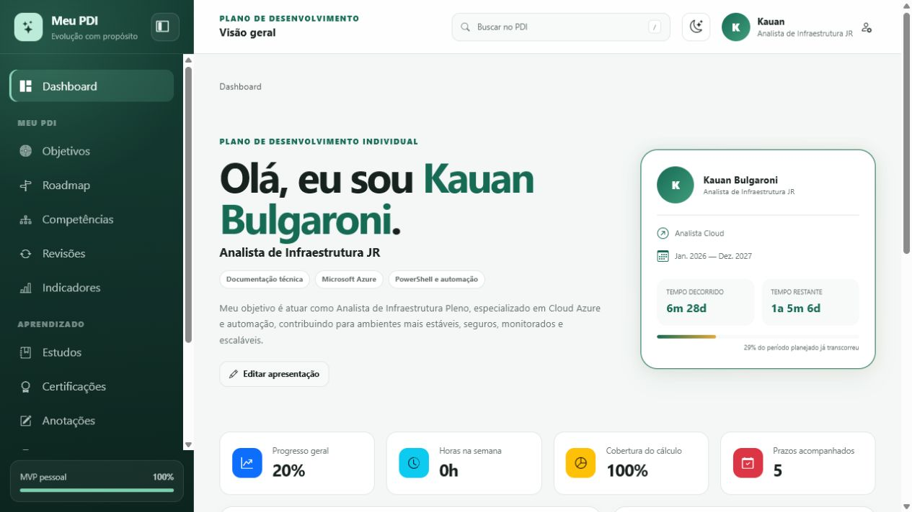
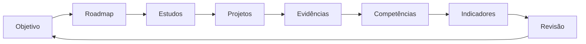
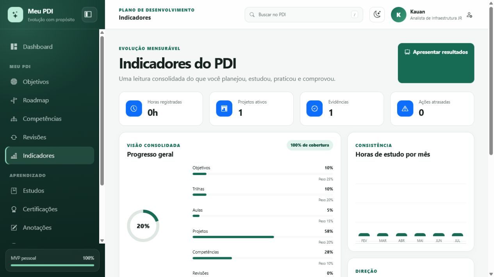
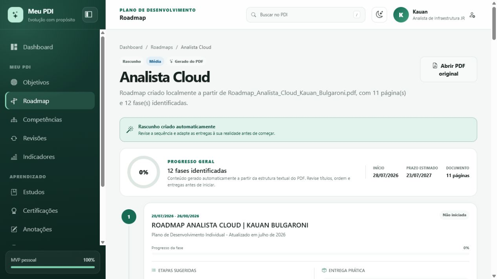
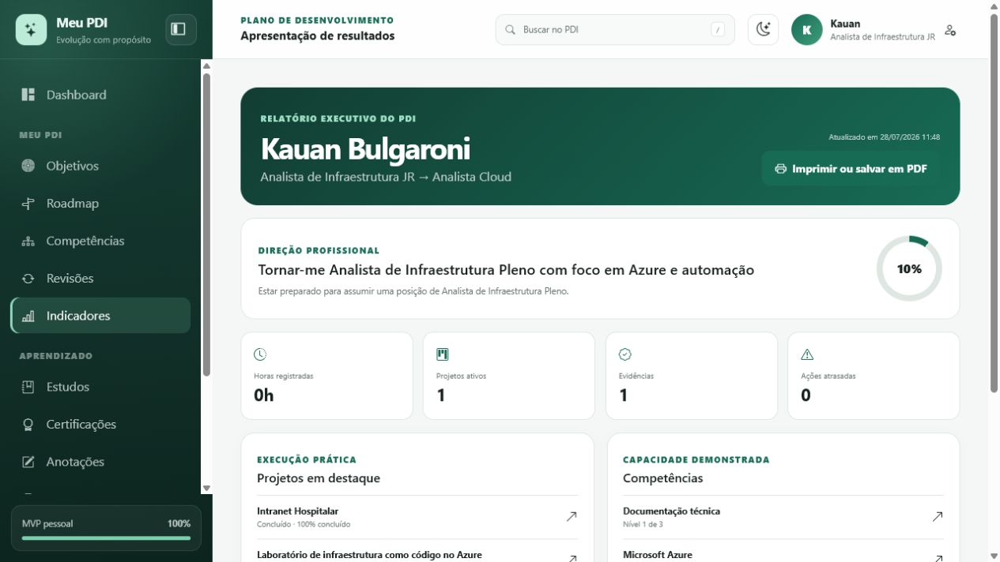
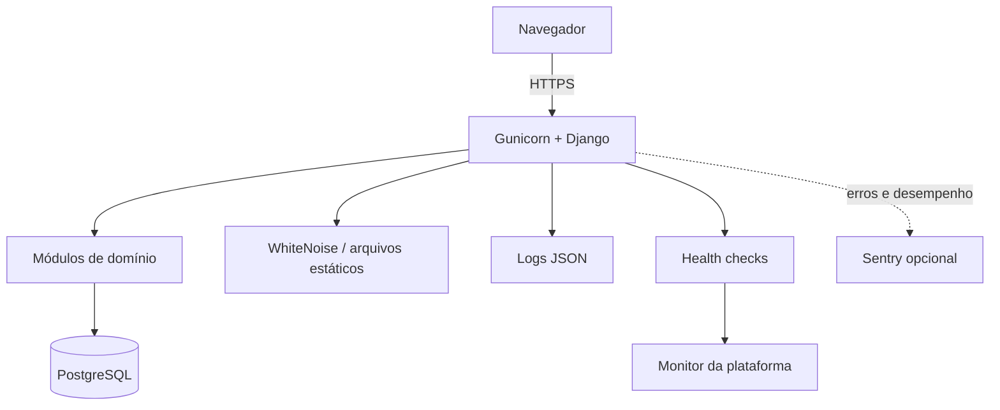

# Meu PDI

Aplicação web para planejar, executar e comprovar o desenvolvimento pessoal e
profissional. O sistema transforma objetivos em roadmaps, conecta estudos a
projetos práticos e apresenta a evolução por indicadores e evidências.



## Por que este projeto existe

Planos de desenvolvimento costumam terminar como documentos estáticos. O Meu
PDI trata o plano como um ciclo contínuo:



## Principais entregas

- dashboard pessoal com direção profissional, prazos e ritmo de estudos;
- objetivos mensuráveis com histórico, progresso e próxima ação;
- roadmap criado a partir de PDF, com etapas concluíveis;
- cursos, disciplinas e conteúdos relacionados;
- anotações ricas e biblioteca privada de PDFs;
- projetos com tarefas, marcos, tecnologias e evidências visuais;
- competências avaliadas obrigatoriamente por evidências;
- revisões periódicas e planejamento de certificações;
- indicadores consolidados e relatório executivo imprimível;
- busca global, modo claro/escuro e interface responsiva;
- versão pública somente leitura para demonstração segura.

## Demonstração visual

| Dashboard | Indicadores |
| --- | --- |
|  |  |

| Roadmap | Resultados |
| --- | --- |
|  |  |

O roteiro completo está em [docs/DEMONSTRACAO.md](docs/DEMONSTRACAO.md).

## Arquitetura

Aplicação monolítica modular, server-rendered, construída com Django 5.2 LTS.
Cada domínio possui modelos, formulários, seletores, serviços, rotas e testes
próprios. PostgreSQL é usado em produção e SQLite facilita o desenvolvimento
local.



Detalhes e decisões: [docs/ARQUITETURA.md](docs/ARQUITETURA.md).

## Tecnologias

- Python 3.10–3.14 e Django 5.2 LTS;
- PostgreSQL em produção e SQLite no desenvolvimento;
- Django Templates, Bootstrap 5, Bootstrap Icons e HTMX;
- pypdf para extração local de documentos;
- Gunicorn, WhiteNoise e configuração por variáveis de ambiente;
- Docker e Render Blueprint para implantação reproduzível;
- Sentry opcional, logs JSON e endpoints de saúde.

## Executar localmente no Windows

```powershell
python -m venv .venv
.\.venv\Scripts\python.exe -m pip install -r requirements.txt
Copy-Item .env.example .env
.\.venv\Scripts\python.exe manage.py migrate
.\.venv\Scripts\python.exe manage.py seed_demo
.\.venv\Scripts\python.exe manage.py runserver
```

Acesse [http://127.0.0.1:8000](http://127.0.0.1:8000). Depois da primeira
instalação, também é possível iniciar com dois cliques em `iniciar.cmd`.

Para carregar toda a demonstração:

```powershell
.\.venv\Scripts\python.exe manage.py seed_objetivos
.\.venv\Scripts\python.exe manage.py seed_estudos
.\.venv\Scripts\python.exe manage.py seed_anotacoes
.\.venv\Scripts\python.exe manage.py seed_projetos
.\.venv\Scripts\python.exe manage.py seed_competencias
.\.venv\Scripts\python.exe manage.py seed_revisoes
.\.venv\Scripts\python.exe manage.py seed_certificacoes
```

Os comandos são idempotentes e não duplicam os registros.

## Testes e qualidade

```powershell
.\.venv\Scripts\python.exe manage.py check
.\.venv\Scripts\python.exe manage.py makemigrations --check --dry-run
.\.venv\Scripts\python.exe manage.py test
.\.venv\Scripts\python.exe -m pip check
```

O pipeline em `.github/workflows/ci.yml` repete essas verificações em cada push
e pull request.

## Segurança

A instalação pessoal permanece sem tela de login, pois foi criada para uso
individual. Esse modo nunca deve ser exposto diretamente à internet.

Para recrutadores, `PUBLIC_DEMO_MODE=true` ativa uma versão pública somente
leitura:

- requisições de alteração são recusadas;
- PDFs e imagens não são servidos diretamente pelo diretório de uploads;
- uploads passam por tamanho, assinatura e tipo permitido;
- cookies seguros, HTTPS, HSTS, CSP e demais cabeçalhos são habilitados;
- chaves, banco e integrações são fornecidos por variáveis de ambiente;
- logs não incluem conteúdo pessoal.

Threat model e controles: [docs/SEGURANCA.md](docs/SEGURANCA.md).

## Logs e monitoramento

- `/health/live/`: confirma que o processo está respondendo;
- `/health/ready/`: confirma aplicação e conexão com o banco;
- uma linha JSON por requisição em produção;
- `X-Request-ID` para correlacionar erros e acessos;
- integração opcional com Sentry por `SENTRY_DSN`;
- `healthCheckPath` configurado no `render.yaml`.

Guia operacional: [docs/OPERACOES.md](docs/OPERACOES.md).

## Implantação

O repositório inclui `render.yaml`, `Dockerfile` e `scripts/build.sh`.

No Render:

1. publique o repositório no GitHub;
2. crie um Blueprint apontando para o repositório;
3. confirme o serviço web e o PostgreSQL definidos no `render.yaml`;
4. opcionalmente configure `SENTRY_DSN`;
5. aguarde `/health/ready/` ficar saudável.

O build instala dependências, coleta arquivos estáticos, aplica migrations e
carrega dados demonstrativos. A implantação pública inicia automaticamente em
modo somente leitura.

## Documentação

- [Arquitetura](docs/ARQUITETURA.md)
- [Segurança](docs/SEGURANCA.md)
- [Operação, logs e monitoramento](docs/OPERACOES.md)
- [Indicadores e resultados](docs/RESULTADOS.md)
- [Demonstração visual](docs/DEMONSTRACAO.md)
- [Checklist de produção](docs/CHECKLIST_PRODUCAO.md)
- [Aceite do MVP](docs/ACEITE_MVP.md)

## Estrutura resumida

```text
config/          configurações por ambiente e rotas principais
core/            dashboard, busca, health checks e observabilidade
objetivos/       metas e histórico
roadmap/         geração a partir de PDF
estudos/         cursos, disciplinas e conteúdos
projetos/        execução prática e evidências
competencias/    avaliações comprovadas
indicadores/     métricas e apresentação de resultados
docs/            documentação técnica e visual
```

Projeto pessoal de Kauan Bulgaroni, criado para demonstrar evolução profissional
com planejamento, execução, evidências e resultados mensuráveis.
