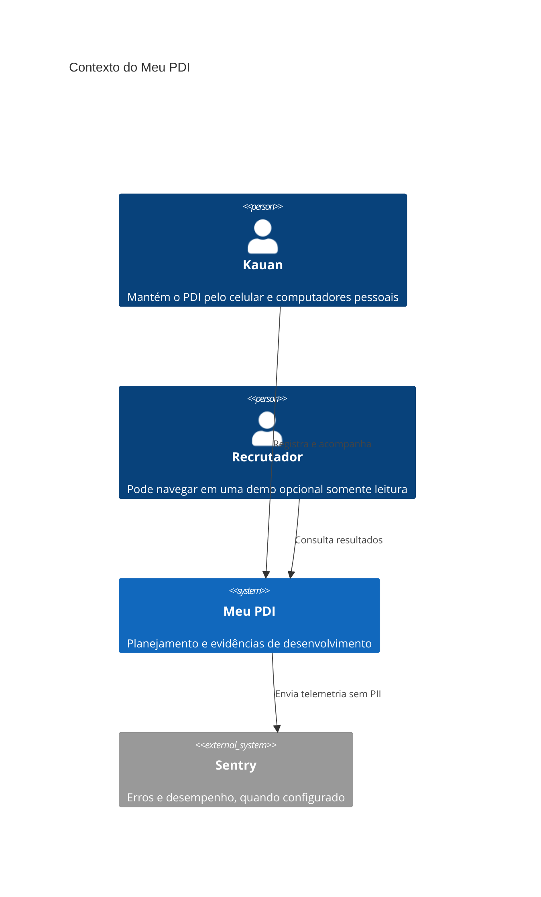
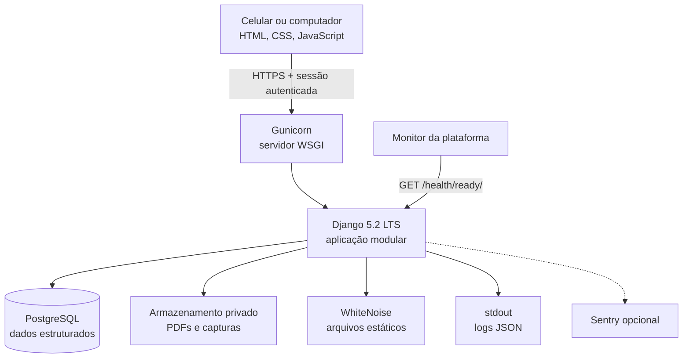
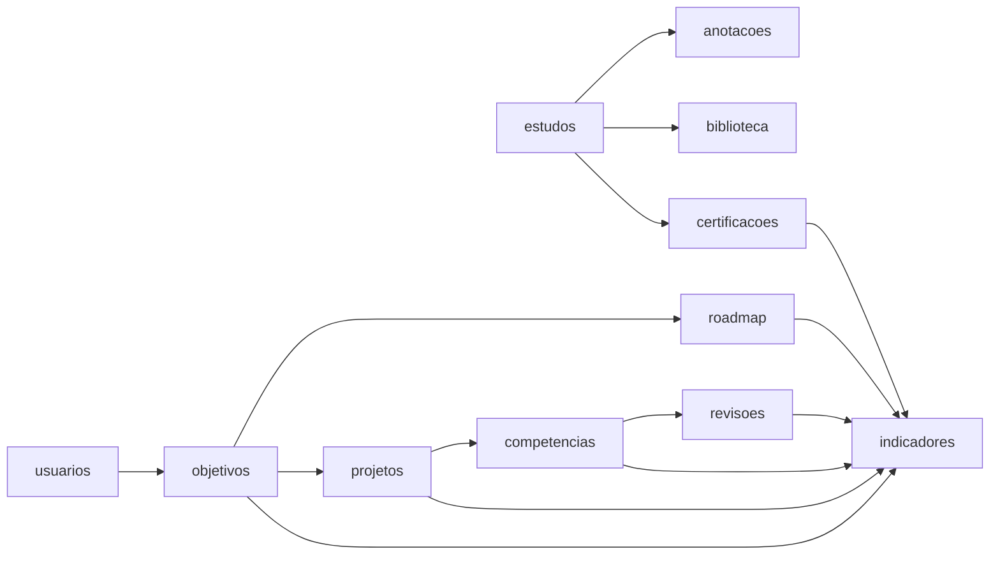
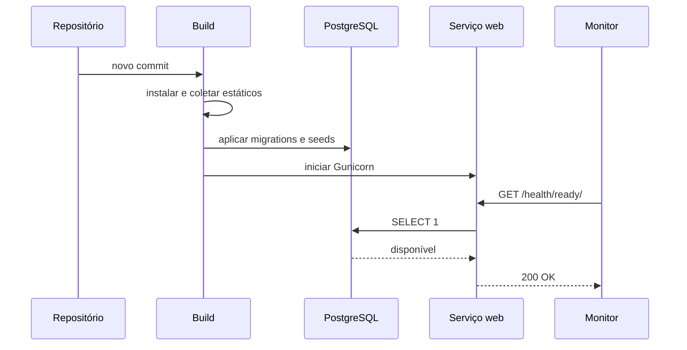

# Arquitetura

## Visão de contexto

## Contêineres

## Módulos de domínio

Cada módulo mantém sua própria camada de persistência e interface. Consultas
consolidadas ficam em `selectors.py`; regras que alteram vários registros ficam
em `services.py`; views coordenam HTTP e templates.

## Decisões

| Decisão | Justificativa | Consequência |
| --- | --- | --- |
| Monólito modular | Escopo pessoal e implantação simples | Uma unidade de deploy |
| Server-side rendering | Menos complexidade e boa acessibilidade | Interações ricas pontuais |
| PostgreSQL em produção | Integridade e operação gerenciada | Requer serviço de banco |
| SQLite local | Instalação rápida no Windows | Não é usado no deploy público |
| Login obrigatório na instalação publicada | O PDI é pessoal e editável pela internet | Somente o proprietário acessa os dados |
| Demo pública opcional somente leitura | Apresentação sem expor edição | Recrutadores navegam sem risco de alteração |
| Upload privado | PDFs e evidências podem conter dados sensíveis | Acesso sempre passa por autorização |
| Logs em stdout | Compatível com contêineres e plataformas | Retenção pertence à plataforma |

## Fluxo de implantação

